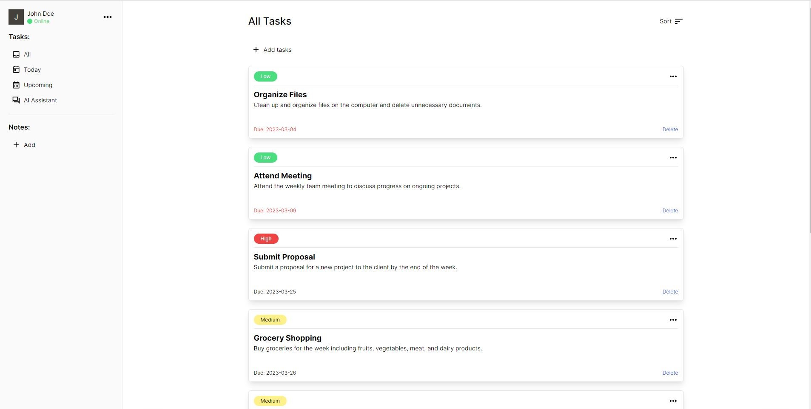
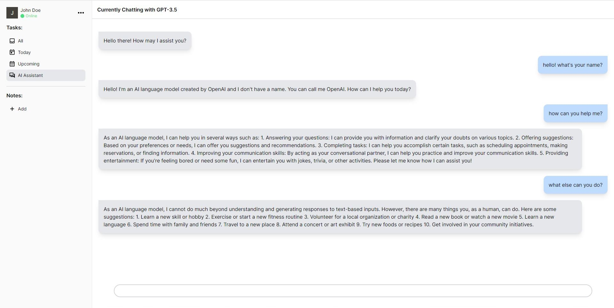
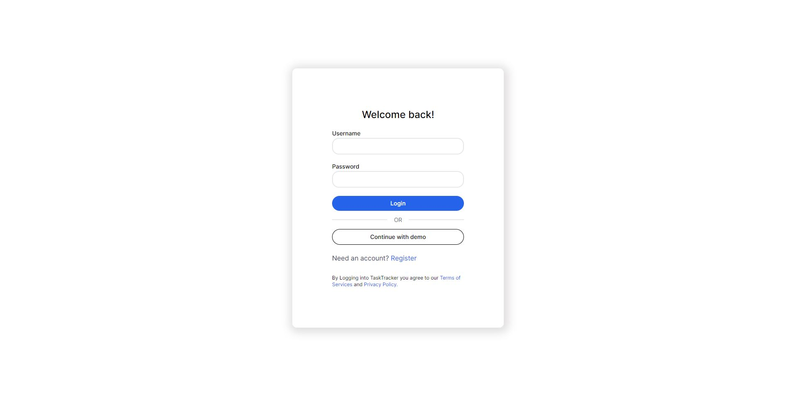

# Task Tracker

Task Tracker is a simple and efficient task management app designed to help users stay organized and focused. With Task Tracker, users can create notes, tasks, chatting with AI Assistant, and much more, all in one place.

Project is live on: https://task-tracker-tool.netlify.app

## Screenshots

## Features

- <b>Task creation and management</b>: Users can create new tasks, set due dates, and add descriptions to each task. They can track the status of each task, and mark tasks as complete. Users can assign priority levels to their tasks and filter their tasks based on priority, due date, and title name.
- <b>GPT Chatbot Integration</b>: Users can chat with the GPT chatbot to get suggestions and recommendations for task management and organization. The chatbot can also provide helpful tips to keep users on track.
- <b>Custom Note Pages</b>: Users can create custom note pages similar to Notion, and for each page, they can write notes using editable-react. They can style blocks by starting a block with "/" and convert a "p" to "h1" styling. This allows users to organize their notes and ideas more effectively.

## Technologies

- Django
- Django Rest framework.
- JWT
- OpenAI
- Vite
- TailwindCSS
- Typescript
- React
- React-Contenteditable
- Redux
- Axios
- Dayjs
