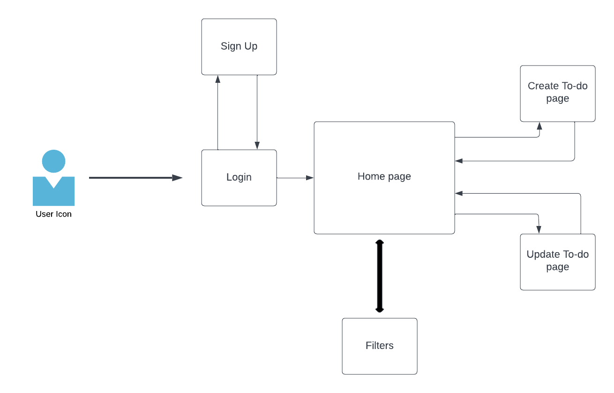

#  Design Docs

# Task Stack (Task management App)

Author: Haopeng Zeng  

Date: 10/24/2022 (Updated)  

#  :man_technologist: Overview

I have started this project with the purpose of learning how to developed a full stack application using Django and Django REST Framework as backend and Vue.js as frontend. This project initially was just a simple to-do-list, but later I decided to add extra more features and turn it into a more complex project called Task management application that supports much features.

This project allows people to create to-do lists. In order to use this project, users will needs to sign up for an account so that they can create to-do-lists that only belongs to them and no other users can view the to-do-lists. User also have the options to sign in as demo user; however, all demo users shares a single account and therefore to-do-lists created by demo user can be view by all other people who signed in as demo user. It is recommend to create your own account when using this application. Once a to-do-list has been created, user can delete it or update it (CRUD).

I put a lot of effort in this Project and I hope that you could enjoy it.

#  Problem Statement

##  Initial Project Specifications

 1. Simple and Good looking UI
 2. User Authentication (Login & Signup)
 3. Track all To-do-lists
 4. Create To-do-lists
 5. Delete To-do-lists
 6. Update-To-do-lists
 7. User able to mark a to-do-item as Complete / Incomplete
 8. User able to set a deadline to a to-do-items
 9. Responsive web design
 10. User able to filter to-do-lists based on whether to-do-items are completed / incomplete
 11. User able to sort to-do-lists based on nearest deadline.
 12. Data Sync across all platforms

## Optional Features (Include if have time)

 1. Marking a to-do-items Important
 2. Voice to text features
 3. Status tracking
 4. Priority Levels

## Audience

| Who / Why?| Explanation |
| --- | --- |
| Target Audience | People who wants a productivity tools that helps them organize and prioritize tasks |
| Core User Need | Easy Set Up and Easy creations of To-Do items with lots of features |

## Key User Stories and Tasks
| Title | User Story Description | Priority |
|--|--|--|
| Login Page | As a user, I want a login page so that I can login to my account, and only I can login to the account. | Must have |
| Signup Page | As a user, I want a sign up page so that I can create my account so that I can login to my account to use the website | Must have
| Login with only username and password | As a user, I want to sign in quickly; hence I don't want too much infos to be required when sign in. (Ex: 2-step verification). (Trade-off: Security) | Must have |
| Home page | As a developer, I want a page where users can see all their to-do-lists|Must have|
| To-do-item-page | As a user, I want a page that I can directly edit a to-do-item. For example, I can mark this to-do as complete, re-set deadline, change contents, or delete it | Must have |
| to-do-items CRUD | As a user, I must able to create, read, update, and delete a to-do-items | Must have |
| to-do-item Due Date | As a user, it would be great if I can add due dates to my to-dos | Must have |
| to-do-item with Priority Levels | As a user, it would be great if I can set priority level of my to-dos | Must have |
| Filter by complete | As a user, I want to mark my to-dos as completed | Must have |
| Filter by incomplete | As a user, I want to mark my to-dos as incompleted | Must have |
| Sort by nearest due date | As a user, it would be great if I can sort the to-dos by due date | Must have | Must have |
| Marking a to-do-items Important | As a user, I would like to mark a to-dos as important | Must have |
| Filter by Important | As a user, I want to filter my to-dos as important | Must have |
| Status tracking | As a user, I want to see the current status of a to-do items | Optional |
| Responsive web design | As a user, I want the app to work on any devices | Must have |
| Voice to text features | As a user, It will be great if I can add to-dos by speaking | Optional |
| JWT Authentication | As a developer, I want the user to login/signup securly | Must have |

## Technical Requirements

### Backend REST API Routes
| Endpoint URL | Request type (GET, POST, etc.) | Description of the request/response |
|--|--|--|
| admin/ | GET/PUT/POST/DELETE | Django Default admin page |
| api/accounts/signup/ | POST | REST API to sign up user |
| api/accounts/login/ | POST |  REST API to login user |
| api/accounts/token/refresh | POST | REST API to refresh the access token |
| api/items/| GET | REST API to get All to-dos that belongs to a user |
| api/items/| POST | REST API to create an to-do that belongs to a user |
| api/items/:id/ | GET | REST API to get a particular to-do |
| api/items/:id/ | PUT | REST API to update a particular to-do |
| api/items/:id/ | DELETE | REST API to delete a particular to-do |

 
 

### Frontend Routes
| Endpoint URL | Description of the request/response |
|--|--|
|  | Default page where user login their account |
| signup/ | Page where user sign up their account |
| home/ | Page where user can view their to-dos |
| createItems/ | Page where user can create a to-do |
| indivi dualItems/:id | A detail page about a specific to-do |

 
 

### Data Schemas

#### User Model
| Column | data type | Details |
|--|--|--|
| pk | int | Primary key that is automatically generated in Django Models |
| username | string | User's username to login |
| password | string | User's password |

 
 

####  Item Model
| Column | data type | Details |
|--|--|--|
| username | string | foreign key to username in User model |
| title | string | title of a to-do |
| content | string | main content of a to-do |
| completed | string | info about whether a to-do is completed |
| dueDate | string | due date of a to-do |
| priority | string | priority of a to-do (High/Medium/low) |
| progress | int | current progress of a to-do |

 
 
 
 

# Section 2: HOW

### Deployment: Heroku

### Third-Party Libraries
| Third-party library name and version | Why it is needed |
|--|--|
| daphne (channels) | Need this library to server both HTTP (WSGI) and Websocket(ASGI) |
| channels-redis | Need this library for deployment as We need to use Redis for Django Channels layers |
| Django | Backend Framework |
| django-cors-headers | Need this library to enable CORS during development |
| djangorestframework | Need this library for REST API and JWT |
| djangorestframework-simplejwt | Need this library for JWT access token and refresh token |
| gunicorn | Need this library to server WSGI |
| python-dotenv | Need this library to read file from .env file |
| pytz | Need this library to record the time a message is send |
| whitenoise | Need this library to serve the static file |

 
 

### Service Dependencies (Third-Parties APIs?)
| Dependency name | Why it is needed | What our plan is, if the dependency fails under us |
|--|--| -- |
| None | None | None |

# Section 3: Key High-Level and Architectural Decisions

## Authentication Process
JWT Token

## The Design Diagram
